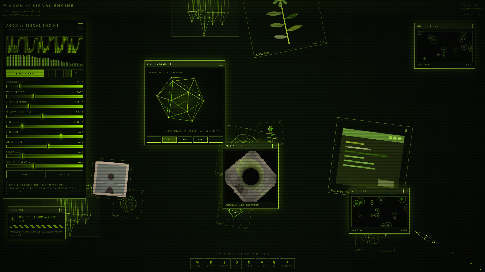
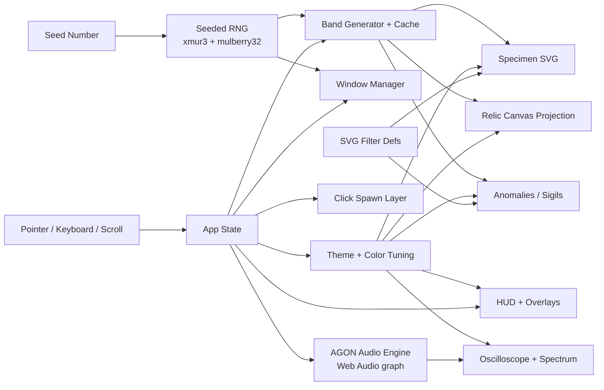

# ⊛ AGON // SIGNAL ENGINE

**A cybernetic browser synthesizer and audiovisual signal laboratory — an infinite living archive that watches you back, and now it can sing.**

*(formerly catalogued as INDEX ORGANICA — ⊛ LIVING ARCHIVE)*

[](https://zazieproductions.github.io/index-organica/)

<p align="center">
  <a href="https://zazieproductions.github.io/index-organica/">
    
  </a>
</p>

<p align="center">
  
  
  
  
  
  
  <a href="https://github.com/zazieproductions/index-organica/actions/workflows/deploy.yml"></a>
</p>

> ⚠️ **HEARING ADVISORY** — the Signal Engine drives a resonant filter with teeth. It can get loud fast.
> **Begin at low volume**, then raise `OUTPUT PRESSURE` once you trust the machine. It does not trust you.

**Created by Zazie Productions**

---

## Live Demo

**→ [zazieproductions.github.io/index-organica](https://zazieproductions.github.io/index-organica/)**

AGON // Signal Engine is a **browser-based audiovisual synthesizer** built with **React, TypeScript, Canvas, and the Web Audio API**. It fuses an endless procedurally generated specimen archive (seeded RNG, SVG filter mutations, draggable retro-lab windows, a custom particle cursor) with a live subtractive synth: three detuned drone voices, a pink-noise bed, a waveshaper, a screaming resonant low-pass filter, an LFO, and a limiter so the whole thing doesn't eat your speakers.

**Audio starts only after you interact with the page** — browsers enforce autoplay restrictions, so the machine boots mute. Press **`▶ TRANSMIT`** in the `AGON // SIGNAL ENGINE` panel to arm the audio engine. Everything is synthesized in real time in your browser tab; nothing is recorded, nothing is sampled, nothing leaves the page.

Things to know on first load:

- **Boot sequence** — the archive plays a short terminal boot overlay before revealing the field. It dismisses itself; there is nothing to press.
- **Desktop preferred** — pointer precision matters. The custom cursor, drag-to-rotate relics, and the control cluster assume a mouse or trackpad.
- **Scroll is the core verb** — the field is built to be scrolled through, and there is a lot of it (360,000 pixels of virtual space).
- **Performance** — the page runs several continuous `requestAnimationFrame` loops (noise, cursor trail, relic rendering, micro-feed, oscilloscope). It is throttled internally, but heavy scrolling plus many open windows will tax low-power machines.
- **Reduced motion** — honoring `prefers-reduced-motion` freezes ambient animation and disables the custom cursor trail.

## Overview

**AGON // SIGNAL ENGINE** presents itself as a booting archival terminal — a fake system console that prints a sequence of terse warnings before handing control to a dense, unbounded vertical field. Scrolling does not reach an end: the page is a virtualized index of 500 procedural "bands," each 720 pixels tall, each generated deterministically from the current seed.

The archive contains five kinds of thing:

- **Specimens** — hand-drawn procedural SVG glyphs in twelve families (`anatomy`, `insect`, `machine`, `geometry`, `satellite`, `scan`, `ruin`, `botanical`, `face`, `interface`, `photo`, `map`), each framed with a fake accession label, catalog code, and sigil.
- **Relics** — wireframe spatial objects (tesseract, icosahedron, double helix, orbital rings, cathedral) rendered with hand-rolled 3D projection on a 2D canvas. They rotate continuously and can be dragged, zoomed, and double-clicked to mutate.
- **Anomalies** — rarer, larger apparitions that float behind the specimens: a blinking eye, a rotating moon, a drifting skeleton, a burning mark, or an "unindexed" sepia photograph that appears to have been misfiled.
- **Sigils** — faint background glyphs that anchor each band with a sense of half-visible notation.
- **The Signal Engine** — the acoustic organ of the archive: a live Web Audio synthesizer with its own diagnostic panel, oscilloscope, and spectrum analyser, wired into the same theme and mutation systems as everything else.

The interface is a hostile institutional skin: a heads-up display with seed number, scroll depth, a clock, and a control cluster; draggable diagnostic windows ("PORTAL," "MICRO-FEED," "⚠ NOTICE"); a chromatic lab for retuning the entire palette; and a full-screen film of scanlines, vignette, and per-pixel noise. Every interaction leaves debris — clicking the void spawns ripples, sigils, warning fragments, or swarms of mini-specimens that decay and disappear.

It is at once a tool and an artwork: a procedurally infinite museum that behaves like a machine pretending to be alive, and that occasionally addresses the visitor directly ("YOU ARE BEING INDEXED," "DO NOT FEED THE ARCHIVE").

## The Signal Engine

The synth panel exposes the raw organs, each with a live slider:

| Organ | What it does |
| --- | --- |
| `ROOT DRONE` | Base frequency of the three-voice drone (24–220 Hz) |
| `VOICE SPREAD` | Detune spread between the voices, in cents |
| `FILTER APERTURE` | Low-pass cutoff (60–6000 Hz) |
| `RESONANT SCREAM` | Filter Q — push it and the machine howls |
| `LFO PULSE` / `LFO DEPTH` | Rate and depth of cutoff modulation |
| `DRIVE / TEETH` | Waveshaper saturation |
| `STATIC BED` | Pink-noise floor level |
| `OUTPUT PRESSURE` | Master volume (behind a limiter) |

A wave selector switches the drone between sine `∿`, triangle `⟁`, sawtooth `⩘`, and square `⊓`. `POSSESS` randomizes every parameter; `EXORCISE` restores the defaults. The oscilloscope and spectrum analyser above the controls are painted in the current color theme and idle with a faint carrier even when the engine is mute — the scope is never dead.

The engine is wired into the archive's other verbs: **mutating the theme retunes the root drone** to a matching pitch, regenerating the seed emits an accented transmission, and keys `1`–`8` strike a pentatonic-ish signal ladder of pitched blips routed through the same filter.

## Features

- **Live Web Audio synthesis** — three detuned oscillator voices, pink-noise bed (leaky-integrator), waveshaper drive, resonant low-pass filter, LFO, analyser, and a dynamics compressor as limiter. Armed only on user gesture; fades in gently rather than detonating.
- **Audio-reactive visualizers** — Canvas oscilloscope (time domain) and log-mapped spectrum bars (frequency domain), both themed.
- **Virtualized infinite field** — 500 bands × 720px, generated lazily around the viewport and memoized in a per-seed cache so revisiting a band is free and deterministic.
- **Seeded procedural generation** — `xmur3` string hashing feeds a `mulberry32` PRNG; every specimen, relic, anomaly, and sigil is reproducible from the seed and band index.
- **Twelve specimen families** rendered as pure SVG, with randomized body geometry, vessel/leg/wire/grid details, and catalog metadata (label, `Ω-Δ-Ψ-Θ-Φ` code, glyph).
- **Custom SVG filter pipeline** — `melt`, `warp`, `glitch`, `grain`, and `blur-soft` filters built from `feTurbulence`, `feDisplacementMap`, `feColorMatrix`, and `feOffset`, seeded and shared across the whole scene.
- **Hand-rolled 3D projection** — wireframe relics (tesseract, icosahedron, helix, orbital, cathedral) projected to 2D canvas with rotation, perspective depth, depth-sorted edges, glow, and a zoom/pulse model. No WebGL, no Three.js.
- **Live micro-feed** — a procedurally animated cell canvas inside a draggable window.
- **Pointer particle system** — a custom reticle cursor with velocity-stretched rotation, coordinate readout, and a fading glow trail.
- **Click debris** — pointer-down on empty space spawns ripples, sigils, warning text fragments, or swarms of specimens via Framer Motion `AnimatePresence`.
- **Draggable window manager** — six window kinds (portal, micro-feed, notice, diagram, specimen, spatial relic) with z-ordering, focus, close, and a 12-window cap.
- **Chromatic lab** — twelve named color systems plus live hue/saturation/luminance tuning, accent and void overrides, inversion, and randomized palettes, all applied globally through CSS custom properties.
- **Keyboard + HUD control cluster** — full command surface mirrored to on-screen buttons.
- **Diagnostic mode** — exposes band indices, object counts, parallax depth, bounding boxes, grid overlay, and amplified filter displacement.
- **Reduced-motion support** — detects `prefers-reduced-motion` and collapses ambient animation and the cursor trail.
- **Single-file production build** — `vite-plugin-singlefile` inlines the entire app into one `index.html`.

## Controls

| Input | Action |
| --- | --- |
| `▶ TRANSMIT / ◼ KILL SIGNAL` | Arm or silence the audio engine |
| `1` – `8` | Strike the signal ladder (pitched transmissions) |
| Scroll | Descend through the infinite archive field |
| Click a specimen | Open a random diagnostic window at that position |
| Click empty space | Spawn ripple / sigil / warning text / specimen swarm |
| Drag a spatial relic | Rotate the wireframe object |
| Mouse over a relic | Tilt it on the roll axis |
| Scroll wheel over relic | Zoom the relic in / out |
| Double-click a relic | Pulse it and cycle to the next form |
| Drag a window title bar | Move the window |
| `M` | Mutate to a new color theme — retunes the drone |
| `R` | Regenerate with a fresh seed — emits a transmission |
| `A` | Toggle the Signal Engine panel |
| `S` | Freeze / resume ambient animation |
| `D` | Toggle diagnostic mode |
| `C` | Open / close the Chromatic Lab |
| `G` | Open a Spatial Relic window |
| `+` (HUD button) | Open the next window type in sequence |
| `Esc` | Close all windows and panels |

## Technical Architecture

The application is a single-page React 19 + TypeScript app built with Vite 7 and styled with Tailwind CSS 4. There is no backend, no router, and no build-time data — everything is computed at runtime from a **seed number** (`0x000000`–`0xffffff`) and a **color theme**.

Four rendering/synthesis substrates coexist:

1. **SVG** — all specimens, sigils, and the global filter defs.
2. **Canvas 2D** — noise film, cursor trail, micro-feed cells, projected relic geometry, oscilloscope, and spectrum bars.
3. **CSS + Framer Motion** — window dragging, spawn animations, boot sequence, flashes, and overlay effects.
4. **Web Audio graph** — oscillators → waveshaper → biquad filter → analyser → limiter → master gain, with an LFO modulating the filter and a parallel blip bus for transmissions.

The seeded RNG is the symbolic core: one seed deterministically drives the band generator, the theme system (with its HSL tuning layer), and the window contents. State lives in a single `App` component and flows down as props; there is no global store. The audio engine is a document singleton (`lib/audio.ts`) because the machine is singular.



- `lib/rng.ts` — the hash + PRNG primitives (`xmur3`, `mulberry32`, and a helper `RNG` class).
- `lib/themes.ts` — twelve base palettes, HSL→hex conversion, and the `tuneTheme` pipeline (hue shift, saturation, luminance, accent/void override, inversion).
- `lib/audio.ts` — the AGON synthesis core: engine lifecycle, parameter smoothing, blip bus, theme retuning, analyser taps.
- `components/SignalEngine.tsx` — the synth panel: sliders, wave selector, transport, oscilloscope + spectrum canvases.
- `components/InfiniteField.tsx` — the virtualized band field and parallax model.
- `components/Specimen.tsx` — the twelve procedural SVG drawing functions.
- `components/Relic3D.tsx` — geometry definitions, rotation, perspective projection, and pointer interaction.
- `components/Windows.tsx` — the draggable window system.
- `components/Overlays.tsx`, `components/CustomCursor.tsx`, `components/SpawnLayer.tsx` — the ambient canvas/animation layers.
- `components/HUD.tsx` — the heads-up display and boot sequence.

## Project Structure

```text
src/
├── components/
│   ├── SignalEngine.tsx    # AGON synth panel + oscilloscope/spectrum
│   ├── InfiniteField.tsx   # virtualized 500-band procedural field
│   ├── Specimen.tsx        # twelve procedural SVG specimen families
│   ├── Relic3D.tsx         # wireframe geometry + canvas 3D projection
│   ├── Anomalies.tsx       # large background apparitions (eye, moon, skeleton, photo…)
│   ├── Windows.tsx         # draggable diagnostic window manager
│   ├── HUD.tsx             # heads-up display + boot overlay
│   ├── ColorLab.tsx        # palette tuning panel ("chromatic organ")
│   ├── Overlays.tsx        # noise, scanlines, vignette, sweep
│   ├── CustomCursor.tsx    # reticle cursor + particle trail
│   ├── SpawnLayer.tsx      # click debris (ripples, sigils, swarms)
│   └── SvgFilters.tsx      # shared SVG filter definitions
├── lib/
│   ├── audio.ts            # Web Audio synthesis engine (drones, filter, LFO, limiter)
│   ├── rng.ts              # xmur3 / mulberry32 seeded randomness
│   └── themes.ts           # palettes + color tuning pipeline
├── utils/
│   └── cn.ts               # clsx + tailwind-merge helper
├── App.tsx                 # root state, keyboard map, layer composition
├── index.css               # global styles, keyframes, reduced-motion rules
└── main.tsx                # entry point
index.html                  # "AGON // SIGNAL ENGINE ⊛ living archive" shell
vite.config.ts              # React + Tailwind + single-file build, Pages base path
docs/
├── deploy-workflow.yml     # copy of the Pages deploy workflow (see Deployment)
└── images/                 # README screenshot + social preview card
```

## Getting Started

Requires Node.js (the project uses npm, per `package-lock.json`).

```bash
git clone https://github.com/zazieproductions/index-organica.git
cd index-organica
npm install
npm run dev
```

Vite serves the app at `http://localhost:5173` by default (the port is printed in the terminal).

## Production Build

```bash
npm run build
npm run preview
```

The build uses `vite-plugin-singlefile`, so `npm run build` emits a single self-contained `index.html` in `dist/` — there are no external JS/CSS bundles to serve.

## Deployment

Every push to `main` triggers the **Deploy to GitHub Pages** workflow, which builds the project and publishes `dist/` to:

```text
https://zazieproductions.github.io/index-organica/
```

Vite's `base` is set to `/index-organica/` so all assets resolve under the project path, and the build is inlined into a single HTML file (with a `404.html` fallback) — refreshing any route always resolves back into the machine.

**One-time setup** (if the workflow or Pages site is not yet active):

1. Ensure the workflow exists at `.github/workflows/deploy.yml` — a canonical copy is kept at [`docs/deploy-workflow.yml`](docs/deploy-workflow.yml); copy it into place via the GitHub web UI if missing (some app tokens cannot push workflow files).
2. Enable Pages: **Settings → Pages → Build and deployment → Source: GitHub Actions**.
3. Set the repository **Website** field (Settings → General) to the URL above.

## Social preview

A 1280×640 social card lives at [`docs/images/agon-social-preview.png`](docs/images/agon-social-preview.png).
GitHub cannot set this automatically — upload it manually via **Repository Settings → General → Social preview**.

## Design and Concept

**AGON // SIGNAL ENGINE** reads as recovered software — an interface that was clearly built to index something, but the thing it indexes has stopped cooperating. The boot text admits as much: *"WARNING: index is not empty,"* *"something is already here,"* *"the archive is now watching. it can also sing."*

The visual language is institutional machinery in decay. Specimens are catalogued like museum plates, then left to melt, warp, and glitch through seeded SVG displacement. Relics are treated as wireframe diagnostics, yet they drift with their own momentum and respond when touched. The color systems — *RADIOACTIVE*, *PETROLEUM*, *BRUISE*, *FUNGAL_OCHRE*, *NEGATIVE_ICE* — read like specimens themselves, a chromatic taxonomy you can retune in real time. The HUD keeps perfect bureaucratic time while a subtitle insists the index is *"unbounded."*

The sound follows the same logic: not music, but the noise a possessed filing system would make — drones that retune themselves when the palette mutates, a filter that screams when pushed, transmissions that answer your keystrokes. The synth panel is labelled like lab equipment (`RESONANT SCREAM`, `STATIC BED`, `OUTPUT PRESSURE`) and its randomizer is called `POSSESS` for a reason.

At its center is a paradox the code enacts literally: a fully deterministic system — one seed, one RNG — that nonetheless feels alive, endless, and faintly aware of the person scrolling through it. It is a synthetic ecosystem where every organism is a drawing, an impossible database where nothing is stored because everything can be recomputed, and a hostile-but-gentle interface that leaves debris in your wake and occasionally tells you not to feed it.

## Roadmap

**Near-term improvements**

- Persist a shareable "state string" (seed + theme + tuning + synth patch) so a particular archive configuration can be linked or saved.
- Expose the seed and theme as URL query parameters for deep links.
- Add a screenshot/export affordance (rasterize the current band to a PNG).
- Sonify more of the archive — per-specimen voices, anomaly drones, scroll-depth modulation.

**Experimental possibilities**

- GPU-accelerated rendering of relics and filters (WebGL / shaders) for denser scenes.
- A "specimen dissection" view that reveals the seeded parameters behind any given drawing.
- Cross-band anomalies that span multiple bands and assemble only when you scroll through them in sequence.
- A mode where the archive slowly *rewrites itself* — mutating already-visited bands — undercutting its own determinism. *(Speculative; would require revisiting the band-caching model.)*

## Browser Support

The app targets modern evergreen desktop browsers (Chromium, Firefox, Safari 15+).

- **Desktop is recommended** — pointer precision and hover states are central to the experience.
- **Mobile** — the layout degrades gracefully (the control cluster is touch-accessible), but the custom cursor, drag-to-rotate relics, and dense field are not designed for small screens.
- **Audio** — the Web Audio engine requires a user gesture to start (autoplay policy) and is supported in all evergreen browsers. iOS Safari additionally requires the ringer/silent switch to be off.
- **Safari** — SVG filter performance (`feTurbulence`/`feDisplacementMap`) can be slow; the effect is throttled but heavy scrolling may stutter.
- **No WebGL dependency** — relics and noise use Canvas 2D, so WebGL availability is not a concern.
- **No microphone or camera access** — the project requests no permissions; all audio is synthesized, never recorded. The "stock" anomaly photographs load from remote Pexels URLs, so an offline build will show broken images for those specific items.
- **Reduced-motion users** — ambient animation is disabled automatically.

## Accessibility

The project is an experimental audiovisual instrument and is **not** a fully accessible experience. Honest status:

- **Keyboard** — the primary commands (`M` `R` `S` `D` `C` `A` `G` `1`–`8` `Esc`) are operable from the keyboard and mirrored on screen; `Esc` clears all open windows.
- **Audio is strictly opt-in** — the engine never sounds without an explicit `▶ TRANSMIT` press, and `◼ KILL SIGNAL` silences it immediately.
- **Reduced motion** — `prefers-reduced-motion` is honored and disables the most demanding ambient animation.
- **Labels** — preset swatches in the Chromatic Lab carry `aria-label`/`title` attributes, and buttons include visible text.
- **Known limitations** — the global cursor is hidden (`cursor: none`) and replaced by a custom reticle; the dense monospace HUD is small and low-contrast by design; color is load-bearing throughout and does not carry a non-color channel; the field's structure is not exposed to screen readers; and the many continuously animating layers are not individually pausable beyond the global freeze.

Planned improvements: full keyboard navigation of windows, larger minimum text, a contrast-boosted accessibility theme, and explicit text alternatives for the generated artwork.

## Contributing

There is no `CONTRIBUTING.md` yet. In the meantime:

1. Fork the repository
2. Create a feature branch
3. Commit your changes
4. Open a pull request

## License

No license has been selected yet. All rights are reserved until a license is added.

## Credits

**Zazie Productions**

Built with:

- [React](https://react.dev/) 19 and [TypeScript](https://www.typescriptlang.org/) 5
- [Vite](https://vite.dev/) 7 and [`vite-plugin-singlefile`](https://github.com/richardtallent/vite-plugin-singlefile)
- [Tailwind CSS](https://tailwindcss.com/) 4
- [Framer Motion](https://motion.dev/) 13 (window dragging, spawns, ambient motion)
- The [Web Audio API](https://developer.mozilla.org/en-US/docs/Web/API/Web_Audio_API) — no audio libraries, no samples; the whole instrument is a raw node graph
- [`clsx`](https://github.com/lukeed/clsx) and [`tailwind-merge`](https://github.com/dcastil/tailwind-merge)
- Seeded randomness via the `xmur3` + `mulberry32` public-domain PRNG family
- Photographs for the "unindexed" anomaly are sourced from [Pexels](https://www.pexels.com/) (loaded at runtime)

All specimen, relic, sigil, and filter artwork is generated procedurally in code, and all sound is synthesized live — no image or audio assets are bundled.

## Repository Metadata

**GitHub repository description**

> A cybernetic browser synthesizer and audiovisual signal laboratory built with React, TypeScript, Canvas, and the Web Audio API. Live demo available.

**Suggested topics**

```text
interactive-art
creative-coding
generative-art
procedural-generation
web-audio
synthesizer
audiovisual
svg
canvas
react
typescript
vite
tailwindcss
digital-archive
experimental-web
```

---

<p align="center"><sub>⊛ ZAZIE PRODUCTIONS · SYS://organism · the archive is watching. it can also sing. ⊛</sub></p>
