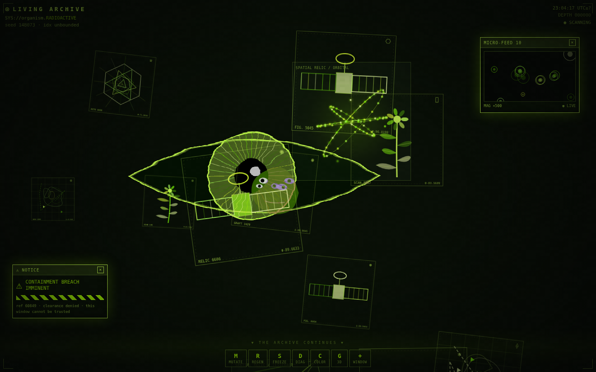
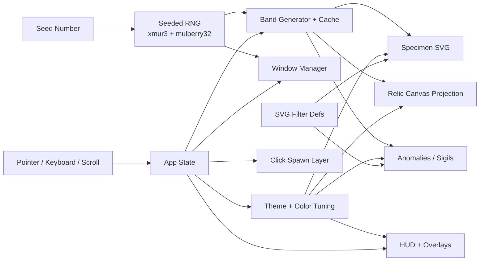
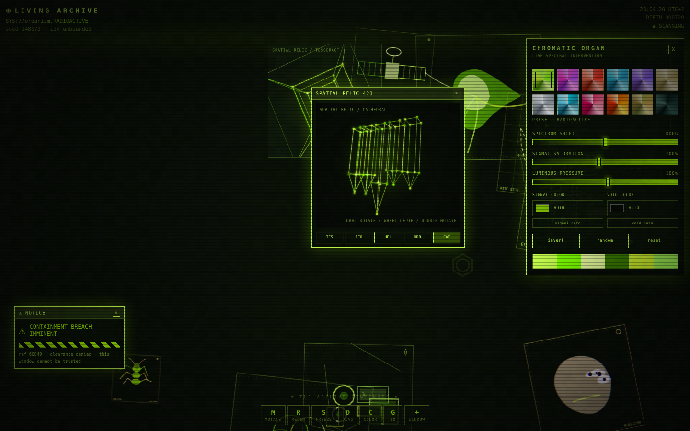
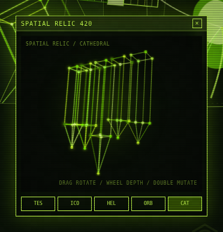

# INDEX ORGANICA — ⊛ LIVING ARCHIVE

A generative, endlessly scrolling archive of procedurally generated specimens, spatial relics, and anomalies that assembles itself from a single seed number and can never be exhausted — part digital archive, part synthetic organism, part institution that has grown past its keepers.

**Created by [Zazie Productions](https://github.com/zazieproductions)**

> Click the preview below to open the interactive project.

[](https://zazieproductions.github.io/index-organica/)

[](https://zazieproductions.github.io/index-organica/)

[](#) [](#) [](#) [](#) [](#)

**No sound.** The archive is silent — there is no Web Audio layer, so no volume warning or headphones are required.

**Quick start:** `npm install && npm run dev`, then open `http://localhost:5173`. Scroll, click the void, and press `M` · `R` · `S` · `D` · `C` · `G` to mutate, regenerate, freeze, diagnose, retune, and summon a spatial relic.

---

## Overview

**INDEX ORGANICA** presents itself as a booting archival terminal — a fake system console that prints a sequence of terse warnings before handing control to a dense, unbounded vertical field. Scrolling does not reach an end: the page is a virtualized index of 500 procedural "bands," each 720 pixels tall, each generated deterministically from the current seed.

The archive contains four kinds of thing:

- **Specimens** — hand-drawn procedural SVG glyphs in twelve families (`anatomy`, `insect`, `machine`, `geometry`, `satellite`, `scan`, `ruin`, `botanical`, `face`, `interface`, `photo`, `map`), each framed with a fake accession label, catalog code, and sigil.
- **Relics** — wireframe spatial objects (tesseract, icosahedron, double helix, orbital rings, cathedral) rendered with hand-rolled 3D projection on a 2D canvas. They rotate continuously and can be dragged, zoomed, and double-clicked to mutate.
- **Anomalies** — rarer, larger apparitions that float behind the specimens: a blinking eye, a rotating moon, a drifting skeleton, a burning mark, or an "unindexed" sepia photograph that appears to have been misfiled.
- **Sigils** — faint background glyphs that anchor each band with a sense of half-visible notation.

The interface is a hostile institutional skin: a heads-up display with seed number, scroll depth, a clock, and a control cluster; draggable diagnostic windows ("PORTAL," "MICRO-FEED," "⚠ NOTICE"); a chromatic lab for retuning the entire palette; and a full-screen film of scanlines, vignette, and per-pixel noise. Every interaction leaves debris — clicking the void spawns ripples, sigils, warning fragments, or swarms of mini-specimens that decay and disappear.

It is at once a tool and an artwork: a procedurally infinite museum that behaves like a machine pretending to be alive, and that occasionally addresses the visitor directly ("YOU ARE BEING INDEXED," "DO NOT FEED THE ARCHIVE").

## Live Demo

> **Live URL:** https://zazieproductions.github.io/index-organica/

The project runs entirely in the browser. Things to know on first load:

- **Boot sequence** — the archive plays a short terminal boot overlay before revealing the field. It dismisses itself; there is nothing to press.
- **Desktop preferred** — pointer precision matters. The custom cursor, drag-to-rotate relics, and the control cluster assume a mouse or trackpad.
- **Scroll is the core verb** — the field is built to be scrolled through, and there is a lot of it (360,000 pixels of virtual space).
- **Performance** — the page runs several continuous `requestAnimationFrame` loops (noise, cursor trail, relic rendering, micro-feed). It is throttled internally, but heavy scrolling plus many open windows will tax low-power machines.
- **Reduced motion** — honoring `prefers-reduced-motion` freezes ambient animation and disables the custom cursor trail.

**This project generates no sound.** There is no Web Audio processing and no volume warning is required; headphones are irrelevant to the experience.

## Features

- **Virtualized infinite field** — 500 bands × 720px, generated lazily around the viewport and memoized in a per-seed cache so revisiting a band is free and deterministic.
- **Seeded procedural generation** — `xmur3` string hashing feeds a `mulberry32` PRNG; every specimen, relic, anomaly, and sigil is reproducible from the seed and band index.
- **Twelve specimen families** rendered as pure SVG, with randomized body geometry, vessel/leg/wire/grid details, and catalog metadata (label, `Ω-Δ-Ψ-Θ-Φ` code, glyph).
- **Custom SVG filter pipeline** — `melt`, `warp`, `glitch`, `grain`, and `blur-soft` filters built from `feTurbulence`, `feDisplacementMap`, `feColorMatrix`, and `feOffset`, seeded and shared across the whole scene.
- **Hand-rolled 3D projection** — wireframe relics (tesseract, icosahedron, helix, orbital, cathedral) projected to 2D canvas with rotation, perspective depth, depth-sorted edges, glow, and a zoom/pulse model. No WebGL, no Three.js.
- **Live micro-feed** — a procedurally animated cell canvas inside a draggable window.
- **Pointer particle system** — a custom reticle cursor with velocity-stretched rotation, coordinate readout, and a fading glow trail.
- **Click debris** — pointer-down on empty space spawns ripples, sigils, warning text fragments, or swarms of specimens via Framer Motion `AnimatePresence`.
- **Draggable window manager** — six window kinds (portal, micro-feed, notice, diagram, specimen, spatial relic) with z-ordering, focus, close, and a 12-window cap.
- **Chromatic lab** — twelve named color systems plus live hue/saturation/luminance tuning, accent and void overrides, inversion, and randomized palettes, all applied globally through CSS custom properties.
- **Keyboard + HUD control cluster** — full command surface mirrored to on-screen buttons.
- **Diagnostic mode** — exposes band indices, object counts, parallax depth, bounding boxes, grid overlay, and amplified filter displacement.
- **Reduced-motion support** — detects `prefers-reduced-motion` and collapses ambient animation and the cursor trail.
- **Single-file production build** — `vite-plugin-singlefile` inlines the entire app into one `index.html`.

## Technical Architecture

The application is a single-page React 19 + TypeScript app built with Vite 7 and styled with Tailwind CSS 4. There is no backend, no router, and no build-time data — everything is computed at runtime from a **seed number** (`0x000000`–`0xffffff`) and a **color theme**.

Three rendering substrates coexist:

1. **SVG** — all specimens, sigils, and the global filter defs.
2. **Canvas 2D** — noise film, cursor trail, micro-feed cells, and the projected relic geometry.
3. **CSS + Framer Motion** — window dragging, spawn animations, boot sequence, flashes, and overlay effects.

The seeded RNG is the symbolic core: one seed deterministically drives the band generator, the theme system (with its HSL tuning layer), and the window contents. State lives in a single `App` component and flows down as props; there is no global store.



- `lib/rng.ts` — the hash + PRNG primitives (`xmur3`, `mulberry32`, and a helper `RNG` class).
- `lib/themes.ts` — twelve base palettes, HSL→hex conversion, and the `tuneTheme` pipeline (hue shift, saturation, luminance, accent/void override, inversion).
- `components/InfiniteField.tsx` — the virtualized band field and parallax model.
- `components/Specimen.tsx` — the twelve procedural SVG drawing functions.
- `components/Relic3D.tsx` — geometry definitions, rotation, perspective projection, and pointer interaction.
- `components/Windows.tsx` — the draggable window system.
- `components/Overlays.tsx`, `components/CustomCursor.tsx`, `components/SpawnLayer.tsx` — the ambient canvas/animation layers.
- `components/HUD.tsx` — the heads-up display and boot sequence.

## Project Structure

```text
src/
├── components/
│   ├── InfiniteField.tsx   # virtualized 500-band procedural field
│   ├── Specimen.tsx        # twelve procedural SVG specimen families
│   ├── Relic3D.tsx         # wireframe geometry + canvas 3D projection
│   ├── Anomalies.tsx       # large background apparitions (eye, moon, skeleton, photo…)
│   ├── Windows.tsx         # draggable diagnostic window manager
│   ├── HUD.tsx             # heads-up display + boot overlay
│   ├── ColorLab.tsx        # palette tuning panel ("chromatic organ")
│   ├── Overlays.tsx        # noise, scanlines, vignette, sweep
│   ├── CustomCursor.tsx    # reticle cursor + particle trail
│   ├── SpawnLayer.tsx      # click debris (ripples, sigils, swarms)
│   └── SvgFilters.tsx      # shared SVG filter definitions
├── lib/
│   ├── rng.ts              # xmur3 / mulberry32 seeded randomness
│   └── themes.ts           # palettes + color tuning pipeline
├── utils/
│   └── cn.ts               # clsx + tailwind-merge helper
├── App.tsx                 # root state, keyboard map, layer composition
├── index.css               # global styles, keyframes, reduced-motion rules
└── main.tsx                # entry point
index.html                  # "LIVING ARCHIVE ⊛ organism" shell
vite.config.ts              # React + Tailwind + single-file build
```

## Getting Started

Requires Node.js (the project uses npm, per `package-lock.json`).

```bash
git clone https://github.com/zazieproductions/index-organica.git
cd index-organica
npm install
npm run dev
```

Vite serves the app at `http://localhost:5173` by default (the port is printed in the terminal).

## Production Build

```bash
npm run build
npm run preview
```

The build uses `vite-plugin-singlefile`, so `npm run build` emits a single self-contained `index.html` in `dist/` — there are no external JS/CSS bundles to serve.

## Capturing Screenshots

Real screenshots are captured from the running app with a headless-browser script:

```bash
npm install
npx playwright install chromium   # first run only
npm run capture:screenshots       # writes docs/images/project-{preview,active,detail}.png
npm run generate:social           # builds the 1280x640 GitHub social-preview card
```

The capture script boots the app, waits out the terminal boot sequence, drives the Chromatic Lab and a spatial relic, and saves three PNGs into `docs/images/` (no browser chrome, cursor, or devtools in the frames).

## Deployment

The project is configured to deploy to GitHub Pages at:

```text
https://zazieproductions.github.io/index-organica/
```

Everything required is committed to the repository:

1. **Vite `base`** — `vite.config.ts` sets `base: "/index-organica/"` for production builds so asset URLs resolve under the repository sub-path (dev keeps the root base, so `npm run dev` stays at `http://localhost:5173/`).

   > The single-file plugin inlines all JS and CSS into one `index.html`, so there are no external bundles to break under the sub-path.

2. **GitHub Actions workflow** — `.github/workflows/deploy-pages.yml` installs dependencies, runs `npm run build`, and publishes `dist/` with `actions/upload-pages-artifact` + `actions/deploy-pages`. It triggers automatically on every push to `main`.

3. **One-time activation (repository owner)** — enable Pages for Actions:

   > GitHub → **Settings** → **Pages** → **Source: GitHub Actions**

   After that, the next push to `main` (or a manual run from the *Actions* tab) deploys the site. If the workflow file is not present on `main` yet, add `.github/workflows/deploy-pages.yml` from this branch first.

4. **Repository Website field** — paste the live URL into *GitHub → Settings → General → Website* so it appears in the repo sidebar.

## Controls

| Input                    | Action                                             |
| ------------------------ | -------------------------------------------------- |
| Scroll                   | Descend through the infinite archive field          |
| Click a specimen         | Open a random diagnostic window at that position    |
| Click empty space        | Spawn ripple / sigil / warning text / specimen swarm |
| Drag a spatial relic     | Rotate the wireframe object                         |
| Mouse over a relic       | Tilt it on the roll axis                            |
| Scroll wheel over relic  | Zoom the relic in / out                             |
| Double-click a relic     | Pulse it and cycle to the next form                 |
| Drag a window title bar  | Move the window                                     |
| `M`                      | Mutate to a new color theme                         |
| `R`                      | Regenerate with a fresh seed                        |
| `S`                      | Freeze / resume ambient animation                   |
| `D`                      | Toggle diagnostic mode                              |
| `C`                      | Open / close the Chromatic Lab                      |
| `G`                      | Open a Spatial Relic window                         |
| `+` / `W` (HUD button)   | Open the next window type in sequence               |
| `Esc`                    | Close all windows and panels                        |

## Screenshots

All screenshots are captured from the running application (see `scripts/capture-screenshots.mjs`). Click any image to open the live project.

### Active System

[](https://zazieproductions.github.io/index-organica/)

### Interface Detail

[](https://zazieproductions.github.io/index-organica/)

## Design and Concept

**INDEX ORGANICA** reads as recovered software — an interface that was clearly built to index something, but the thing it indexes has stopped cooperating. The boot text admits as much: *"WARNING: index is not empty,"* *"something is already here,"* *"the archive is now watching."*

The visual language is institutional machinery in decay. Specimens are catalogued like museum plates, then left to melt, warp, and glitch through seeded SVG displacement. Relics are treated as wireframe diagnostics, yet they drift with their own momentum and respond when touched. The color systems — *RADIOACTIVE*, *PETROLEUM*, *BRUISE*, *FUNGAL_OCHRE*, *NEGATIVE_ICE* — read like specimens themselves, a chromatic taxonomy you can retune in real time. The HUD keeps perfect bureaucratic time while a subtitle insists the index is *"unbounded."*

At its center is a paradox the code enacts literally: a fully deterministic system — one seed, one RNG — that nonetheless feels alive, endless, and faintly aware of the person scrolling through it. It is a synthetic ecosystem where every organism is a drawing, an impossible database where nothing is stored because everything can be recomputed, and a hostile-but-gentle interface that leaves debris in your wake and occasionally tells you not to feed it.

## Roadmap

**Near-term improvements**

- Add an audio layer (Web Audio / procedural synthesis) with a clear opt-in toggle and volume control — the visual engine is already a strong candidate for sonification.
- Persist a shareable "state string" (seed + theme + tuning) so a particular archive configuration can be linked or saved.
- Expose the seed and theme as URL query parameters for deep links.
- Add a screenshot/export affordance (rasterize the current band to a PNG).
- Wire up the GitHub Pages deployment (base path + Actions workflow) described above.

**Experimental possibilities**

- GPU-accelerated rendering of relics and filters (WebGL / shaders) for denser scenes.
- A "specimen dissection" view that reveals the seeded parameters behind any given drawing.
- Cross-band anomalies that span multiple bands and assemble only when you scroll through them in sequence.
- A mode where the archive slowly *rewrites itself* — mutating already-visited bands — undercutting its own determinism. *(Speculative; would require revisiting the band-caching model.)*

## Browser Support

The app targets modern evergreen desktop browsers (Chromium, Firefox, Safari 15+).

- **Desktop is recommended** — pointer precision and hover states are central to the experience.
- **Mobile** — the layout degrades gracefully (the control cluster is touch-accessible), but the custom cursor, drag-to-rotate relics, and dense field are not designed for small screens.
- **Safari** — SVG filter performance (`feTurbulence`/`feDisplacementMap`) can be slow; the effect is throttled but heavy scrolling may stutter.
- **No WebGL dependency** — relics and noise use Canvas 2D, so WebGL availability is not a concern.
- **No microphone or camera access** — the project requests no permissions. The "stock" anomaly photographs load from remote Pexels URLs, so an offline build will show broken images for those specific items.
- **Reduced-motion users** — ambient animation is disabled automatically.

## Accessibility

The project is an experimental visual instrument and is **not** a fully accessible experience. Honest status:

- **Keyboard** — the primary commands (`M` `R` `S` `D` `C` `G` `Esc`) are operable from the keyboard and mirrored on screen; `Esc` clears all open windows.
- **Reduced motion** — `prefers-reduced-motion` is honored and disables the most demanding ambient animation.
- **Labels** — preset swatches in the Chromatic Lab carry `aria-label`/`title` attributes, and buttons include visible text.
- **Known limitations** — the global cursor is hidden (`cursor: none`) and replaced by a custom reticle; the dense monospace HUD is small and low-contrast by design; color is load-bearing throughout and does not carry a non-color channel; the field's structure is not exposed to screen readers; and the many continuously animating layers are not individually pausable beyond the global freeze.

Planned improvements: full keyboard navigation of windows, larger minimum text, a contrast-boosted accessibility theme, and explicit text alternatives for the generated artwork.

## Contributing

There is no `CONTRIBUTING.md` yet. In the meantime:

1. Fork the repository
2. Create a feature branch
3. Commit your changes
4. Open a pull request

A useful first step is adding the missing deployment workflow and screenshot described above.

## License

No license has been selected yet. All rights are reserved until a license is added.

## Credits

**Zazie Productions**

Built with:

- [React](https://react.dev/) 19 and [TypeScript](https://www.typescriptlang.org/) 5
- [Vite](https://vite.dev/) 7 and [`vite-plugin-singlefile`](https://github.com/richardtallent/vite-plugin-singlefile)
- [Tailwind CSS](https://tailwindcss.com/) 4
- [Framer Motion](https://motion.dev/) 13 (window dragging, spawns, ambient motion)
- [`clsx`](https://github.com/lukeed/clsx) and [`tailwind-merge`](https://github.com/dcastil/tailwind-merge)
- Seeded randomness via the `xmur3` + `mulberry32` public-domain PRNG family
- Photographs for the "unindexed" anomaly are sourced from [Pexels](https://www.pexels.com/) (loaded at runtime)

All specimen, relic, sigil, and filter artwork is generated procedurally in code — no image assets are bundled.

## Repository Metadata

**GitHub repository description** (under 160 characters — mentions the live demo):

> A generative, endlessly scrolling archive of procedural specimens, relics and anomalies. Live demo: zazieproductions.github.io/index-organica

**Website field**

Set *GitHub → Settings → General → Website* to:

```text
https://zazieproductions.github.io/index-organica/
```

**Social preview**

A 1280 × 640 social-preview card is committed at `docs/images/github-social-preview.png` (built from the real app screenshot — see `scripts/generate-social-preview.mjs`). Upload it under:

```text
Repository Settings → General → Social preview
```

**Suggested topics**

```text
interactive-art
creative-coding
generative-art
procedural-generation
svg
canvas
react
typescript
vite
tailwindcss
digital-archive
experimental-web
```
